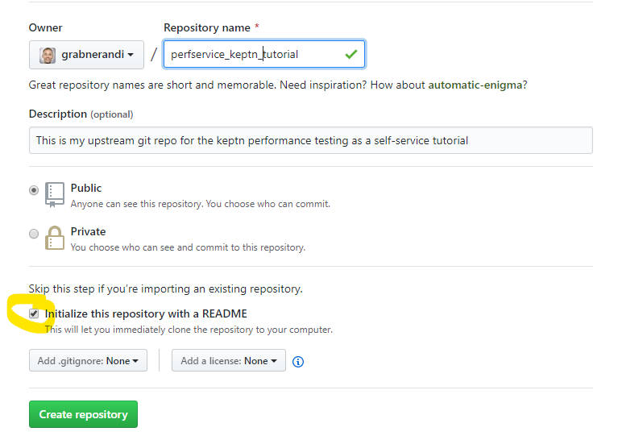
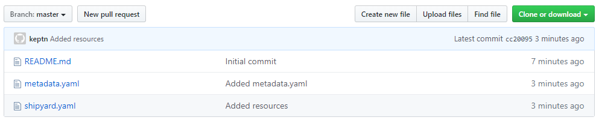
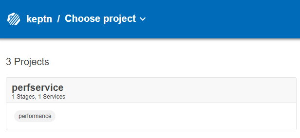
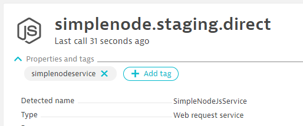
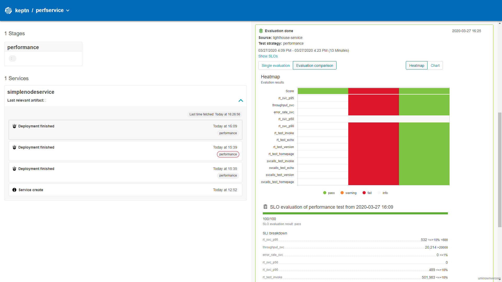

# Tutorial on Performance Testing as a Self-Service

| Author | Keptn-Version |
| ------ | ------------- |
| grabnerandi | 0.6.1 |

If you have an application or service that you have deployed in a dev, test or staging environment then this tutorial shows you how you can use Keptn to
#1: Automatically execute a test, e.g: JMeter, Neotys, ...
#2: Automatically pulls in SLIs (Service Level Indicators) from different tools, e.g: Dynatrace, Prometheus, Neoload ...
#3: Automatically evaluates your SLIs against your SLOs (Service Level Objectives)
#4: All of this as a self-service via command line or API call

Let's go!!

## My Sample App: Simplenodeservice

If you have your own app feel free to use yours - or - feel free to use my very simple node.js based app. Its called "Simplenodeservice" - because - yeah - it is just very simple but it does its job. Also - I have it available in 4 different builds so we can deploy the different versions and have Keptn evaluate performance for us on each build!
Find the source code or the deployment.yaml files here: https://github.com/grabnerandi/simplenodeservice

## Tutorial: Setup Instructions based on my App using Dynatrace for Monitoring

All the following instructions are based on my app, using my JMeter scripts and Dynatrace as a monitoring tool. If you have your own test scripts or a different monitoring tool please refer to the Keptn Doc to learn how you can upload your scripts and how to configure your monitoring tool to deliver your desired SLIs

### Step 1 - Install Keptn

Please do a full installation of Keptn as described in the Keptns doc.
What you need for the rest of the tutorial is your keptn CLI connected to your Keptn cluster!

### Step 2 - Create Project

We will create a new keptn project called *perfservice* using the shipyard.yaml file in this repo. 
The shipyard only defines a single stage called *performance* with a performance test-strategy.
In order to make it easier to modify SLIs, SLOs and maybe test scripts later please create a Git repo, e.g: GitHub, Bitbucket, ... that we can use as upstream git repo. Here is a screenshot on how I created my GitHub repo. MAKE SURE to have the repo initialized with a readme.md!



```
$ keptn create project perfservice --shipyard=shipyard.yaml --git-remote-url=YOURGITREPOURL --git-user=YOURUSER --git-token=YOURGITTOKEN
Starting to create project
Project perfservice created
Stage performance created
Shipyard successfully processed
```

We can now validate the project was successfully created by looking at the Keptn CLI output but also your upstream Git repo:


**Enable Monitoring for Project**
I am going to use Dynatrace for monitoring my Keptn enviornment and also for the Monitoring tool that is monitoring my sample app. Keptn provides a convenient CLI command to enable monitoring - for both Dynatrace & Prometheus in the moment. In order to enable Monitoring of this project with Dynatrace I execute this:
```
$ keptn configure monitoring Dynatrace --project=perfservice
```

In order for Keptn to pull my SLIs from Dynatrace I need to additionally install and configure the [Dynatrace SLI Provider Service](https://github.com/keptn-contrib/dynatrace-sli-service). Make sure you pick the latest version. Here an example to install version 0.3.1! 
```
kubectl apply -f https://raw.githubusercontent.com/keptn-contrib/dynatrace-sli-service/release-0.3.1/deploy/service.yaml
```


### Step 3 - Create Service

Keptn allows you to either *onboard a service* (thats if you want Keptn to also deploy via e.g: Helm charts) or simply *create a service* so that Keptn can create its internally structures as everything in Keptn always operates on project, stage & service level.
For our purposes we create a simplenodeservice as this is the service we want to be running tests and evaluated SLIs/SLOs against. If you are testing against a large application that contains multiple services I recommend you simply create one service with the name of your application.

```
$ keptn create service simplenodeservice --project=perfservice 
Starting to create service
Finished creating service simplenodeservice in project perfservice
```

We can also validate that everything was created correctly by opening up the Keptn's bridge. The new project with the performance stage will show up in the overview:


### Step 4 - Upload Test Files

I have a JMeter test script prepared which will be executed by the *Keptn JMeter Service* which comes with the default Keptn installation. If you don't want JMeter but have a different tool then check out, e.g: Neoload Service or integrate your own testing tools by writing your own Keptn Service that handles the appropriate events.

In our case we upload my load.jmx file to the stage performance of our service. Its important that this file is uploaded to the jmeter subfolder on the Git repo which is why that folder is also specified in the --resource parameter
```
$ keptn add-resource --project=perfservice --service=simplenodeservice --stage=performance --resource=jmeter/load.jmx --resourceUri=jmeter/load.jmx
```

**Note about the JMeter test script:**
It executes several test steps such as homepage, echo, invoke, version. The script also follows the Dynatrace best practice for tagging these executed requests via the X-Dynatrace-Test HTTP Header so that Dynatrace - the monitoring tool I am using - can distinguish incoming requests and can then provide metrics split by test step name.
If you create your own scripts make sure you follow the same practice to truly unleash the power of Keptn SLIs / SLOs in combination with Dynatrace!

### Step 5 - Upload SLIs

I have prepared a list of SLIs which include service response time metrics (p50, p90, p95), througput and failure rate. I also include response time and number of backend service calls for each of the 4 major test cases in my test script: echo, homepage, invoke, version.
Keptn allows you to define the full query string for the SLI. In my case this is a Dynatrace Metrics API v2 Query String. In order for Dynatrace to know from which service I want to pull these metrics I assume the service is tagged with the name of the service we are testing. In my case that is simplenodeservice - the same name I specified during *keptn create service simplenodeservice*. While I could hard-code that tag into the SLI query I leverage the $SERVICE placeholder. This makes the SLI much more flexible and I can reuse it for other projects as well. Other placeholders are $PROJECT, $STAGE & $DEPLOYMENT (only relelvant if you use Keptn for Deployment as well)

Lets have a quick look at two of these SLIs - one showing a regular built-in Dynatrace service metric the other one is a custom calculated service metric that gives me response time for a particular test name:
```
 rt_svc_p95:       "metricSelector=builtin:service.response.time:merge(0):percentile(95)?entitySelector=tag($SERVICE),type(SERVICE)"

 rt_test_homepage: "metricSelector=calc:service.teststepresponsetime:filter(eq(Test Step,homepage)):merge(0):avg?entitySelector=tag($SERVICE),type(SERVICE)"
```

Now lets upload that SLI definition to the Dynatrace folder. As I want to use this SLI definition for my simplenodeservice and later one for other Keptn services as well I upload it on the project level which means it will be used by any service in any stage:
```
$ keptn add-resource --project=perfservice --resource=evaluation/sli.yaml --resourceUri=dynatrace/sli.yaml
```


**Calculated Service Metrics in Dynatrace**
In my SLIs I use a handful of so called calculated service metrics. They are extremly powerful as they allow a user to get answers like: How many database queries does a particular test case execute. Or - what is the CPU consumption of a particular business transaction!
You can either re-create these metrics I am using in my example through the Dynatrace UI - or - you simply execute the scripted I added to this repo like this:
```
./createTestStepCalculatedMetrics.sh
```


### Step 6 - Upload SLO

The SLI file I provided contains a good list of individual indicators. What we need to do now is to define an SLO (Service Level Objective) that indicate what Keptn should do with these SLIs. We have these options after Keptn pulled the value through the SLI Provider
a) Just give me the value
b) Compare the value with a static threshold
c) Compare it with a baseline from previous runs

I prepared an SLO that leverages option b) and c). Open the file yourself to see what I did.
But now - lets upload the file to our service repository. Be aware here that the file gets uploaded into the root folder of our Git repo which is why resourceUri just contains slo.yaml. The idea here is that in future versions of Keptn you can have multiple SLI.yamls (each in the respective subfolder of the provider) and one SLO that allows ou to reference all SLIs from all providers!
```
$ keptn add-resource --project=perfservice --service=simplenodeservice --stage=performance --resource=evaluation/slo.yaml --resourceUri=slo.yaml
```

## Tutorial: Performance Testing as a Self-Service in Action!

### Step 1: Deploy the app

The focus of this tutorial is a scenario where you already have found a way to deploy your application, e.g: using a Jenkins pipeline or maybe even do it manually!
If you have managed to deploy my sample app please make sure that it is monitored with a Dynatrace OneAgent. It doesnt matter whehter you have deployed the app on k8s, plain docker or whether you run it on your local laptop as a native node process. If you have the OneAgent installed on that system it will automatically monitor it.

What you need for the rest of the tuturial is the URL to the app, e.g.: http://yourmachine:8080. Make sure that this URL is accessible from the k8s cluster you have installed Keptn. Why? Because Keptn will later launch our testing tool JMeter and that tool will run tests against that URL!

### Step 2: Validate the tag

Remember? Our SLI definitions assume that Dynatrace is monitoring a service that has a tag on it with the name simplenodeservice. Simply go to Dynatrace, find the simplenodeservice and put a manual tag on it with that name. Like I did here:


### Step 3: Lets tell Keptn to run a test

In order to Keptn to start running a test we need to send it a Deployment-Finished Event. This tells Keptn: "Hey, we have a new deployment on a specific URL. Time to test and evaluate!".
We can send this event via keptn send event using the prepared event file. If you want though you can also send this also via the Keptn API, e.g: via a CURL command.
*Before you run the command* PLEASE edit the deployment.finished.event.json and put in the public URL of your deployed service.
```
$ keptn send event --file=deployment.finished.event.json
```

My default test runs about 10 minutes on my environment. As it runs you should be able to watch the Keptns Bridge to see whats happening!
Here is how my keptns bridge looks like after the first two runs:


### Step 4: Roll this out to your engineers

Now all you have to do is take this and roll it out to your engineers. Either give them access to the Keptn CLI to kick off their test runs or integrate this into your existing delivery pipelines and call Keptn's Performance Testing as a Self-Service from there

ALL THE BEST